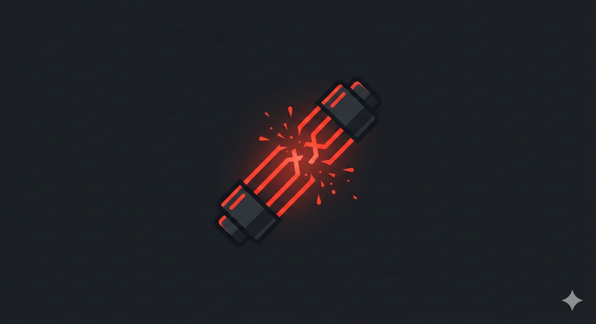
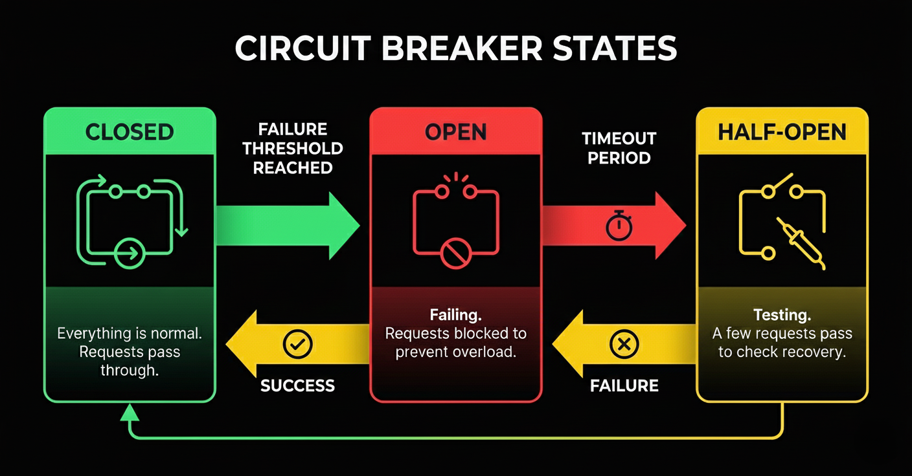
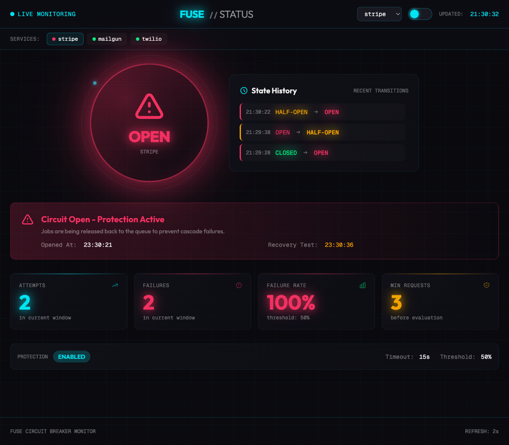

<p align="center">
  
</p>

<p align="center">
  <strong>Circuit breaker for Laravel queue jobs</strong>
</p>

<p align="center">
  Protect your queue workers from cascading failures when external services go down.
</p>

---

## The Problem

When Stripe goes down at 11 PM, your queue workers don't know. They keep trying to charge customers. Each job waits 30 seconds for a timeout. Then retries. Waits again. Your entire queue system freezes.

**Without Fuse:** 10,000 jobs × 30-second timeouts = 25+ hours to clear the queue.

**With Fuse:** Circuit opens after 5 failures. Queue clears in 10 seconds. Automatic recovery when the service returns.

---

## Features

- **Three-State Circuit Breaker** — CLOSED (normal), OPEN (protected), HALF-OPEN (testing recovery)
- **Intelligent Failure Classification** — 429 rate limits and auth errors don't trip the circuit
- **Peak Hours Support** — Different thresholds for business hours vs. off-peak
- **Fixed Window Tracking** — Minute-based buckets with automatic expiration, no cleanup needed
- **Thundering Herd Prevention** — `Cache::lock()` ensures only one worker probes during recovery
- **Zero Data Loss** — Jobs are delayed with `release()`, not failed permanently
- **Automatic Recovery** — Circuit tests and heals itself when services return
- **Per-Service Circuits** — Separate breakers for Stripe, Mailgun, your microservices
- **Laravel Events** — Get notified on state transitions for alerting and monitoring
- **Real-Time Status Page** — Built-in monitoring dashboard with live state updates
- **Pure Laravel** — No external dependencies, uses Cache and native job middleware

---

## How It Works

<p align="center">
  
</p>

**CLOSED** — Normal operations. All requests pass through. Failures are tracked in the background.

**OPEN** — Protection mode. After the failure threshold is exceeded, the circuit trips. Jobs fail instantly (1ms, not 30s) and are delayed for automatic retry. No API calls are made.

**HALF-OPEN** — Testing recovery. After the timeout period, one probe request tests if the service recovered. Success closes the circuit. Failure reopens it.

---

## Installation

```bash
composer require harris21/laravel-fuse
```

Publish the configuration:

```bash
php artisan vendor:publish --tag=fuse-config
```

---

## Quick Start

Add the middleware to your job:

```php
use Harris21\Fuse\Middleware\CircuitBreakerMiddleware;

class ChargeCustomer implements ShouldQueue
{
    public $tries = 0;           // Unlimited releases
    public $maxExceptions = 3;   // Only real failures count

    public function middleware(): array
    {
        return [new CircuitBreakerMiddleware('stripe')];
    }

    public function handle(): void
    {
        // Your payment logic - unchanged
        Stripe::charges()->create([...]);
    }
}
```

That's it. Your job is now protected.

---

## Configuration

```php
// config/fuse.php

return [
    'enabled' => env('FUSE_ENABLED', true),

    'default_threshold' => 50,      // Failure rate percentage to trip circuit
    'default_timeout' => 60,        // Seconds before testing recovery
    'default_min_requests' => 10,   // Minimum requests before evaluating

    'services' => [
        'stripe' => [
            'threshold' => 50,
            'timeout' => 30,
            'min_requests' => 5,

            // Peak hours: more tolerant during business hours
            'peak_hours_threshold' => 60,
            'peak_hours_start' => 9,   // 9 AM
            'peak_hours_end' => 17,    // 5 PM
        ],
        'mailgun' => [
            'threshold' => 60,
            'timeout' => 120,
            'min_requests' => 10,
        ],
    ],

    // Cache prefix — change if multiple apps share the same Redis instance
    'cache' => [
        'prefix' => env('FUSE_CACHE_PREFIX', 'fuse'),
    ],
];
```

---

## Peak Hours

Configure different thresholds for business hours when every transaction matters:

```php
'stripe' => [
    'threshold' => 40,              // Off-peak: more sensitive (40%)
    'peak_hours_threshold' => 60,   // Peak hours: more tolerant (60%)
    'peak_hours_start' => 9,        // 9 AM
    'peak_hours_end' => 17,         // 5 PM
],
```

During peak hours (9 AM - 5 PM), the circuit uses the higher threshold to maximize successful transactions. Outside peak hours, it uses the lower threshold for earlier protection.

---

## Intelligent Failure Classification

Not all errors indicate a service is down. Fuse only counts real outages:

| Error Type | Counted as Failure? | Reason |
|------------|---------------------|--------|
| 500, 502, 503 | Yes | Server errors indicate service problems |
| Connection timeout | Yes | Service is unreachable |
| Connection refused | Yes | Service is unreachable |
| 429 Too Many Requests | No | Service is healthy, just rate limiting |
| 401 Unauthorized | No | Your API key is wrong, not a service issue |
| 403 Forbidden | No | Permission issue, not a service outage |
| 400 Bad Request | Yes | Could indicate API issues |
| 404 Not Found | Yes | Could indicate API changes |

This prevents false positives. A rate limit doesn't mean Stripe is down - it means you're sending too many requests.

---

## Events

Fuse dispatches Laravel events on every state transition:

```php
use Harris21\Fuse\Events\CircuitBreakerOpened;
use Harris21\Fuse\Events\CircuitBreakerHalfOpen;
use Harris21\Fuse\Events\CircuitBreakerClosed;
```

### Listening to Events

```php
// app/Listeners/AlertOnCircuitOpen.php

class AlertOnCircuitOpen
{
    public function handle(CircuitBreakerOpened $event): void
    {
        Log::critical("Circuit breaker opened for {$event->service}", [
            'failure_rate' => $event->failureRate,
            'attempts' => $event->attempts,
            'failures' => $event->failures,
        ]);

        // Send Slack notification, page on-call, etc.
    }
}
```

### Event Properties

**CircuitBreakerOpened:**
- `$service` — The service name (e.g., "stripe")
- `$failureRate` — Current failure percentage
- `$attempts` — Total requests in the window
- `$failures` — Failed requests in the window

**CircuitBreakerHalfOpen:**
- `$service` — The service name

**CircuitBreakerClosed:**
- `$service` — The service name

---

## Status Page

Fuse includes a real-time monitoring dashboard that shows the state of all your circuit breakers.

<p align="center">
  
</p>

### Enable the Status Page

Add to your `.env`:

```env
FUSE_STATUS_PAGE_ENABLED=true
```

The status page is available at `/fuse` (configurable via `FUSE_STATUS_PAGE_PREFIX`).

### Authorization

Access is controlled by a `viewFuse` gate. By default, only the `local` environment is allowed. Override it in your `AppServiceProvider`:

```php
use Illuminate\Support\Facades\Gate;

Gate::define('viewFuse', function ($user = null) {
    return $user?->isAdmin();
});
```

### Configuration

```php
// config/fuse.php

'status_page' => [
    'enabled' => env('FUSE_STATUS_PAGE_ENABLED', false),
    'prefix' => env('FUSE_STATUS_PAGE_PREFIX', 'fuse'),
    'middleware' => [],          // Custom middleware (replaces default)
    'polling_interval' => 2,    // Frontend refresh interval in seconds
],
```

### What It Shows

- **Circuit state** for each configured service (CLOSED, OPEN, HALF-OPEN)
- **State history** with timestamped transitions
- **Live stats** — attempts, failures, failure rate per window
- **Recovery info** — when the circuit opened and when it will test recovery
- **Auto-refresh** — polls the backend every 2 seconds (configurable)

---

## Fallback Strategies

When the circuit opens, your application needs a plan. Here are common strategies:

**Return cached data** — Show last known prices, cached shipping rates, or stale product info. Slightly stale data beats an error page.

**Use a fallback service** — Switch to a backup payment provider, or show "payment pending" and queue it for later.

**Queue for later** — Fuse already does this with `release()`. For synchronous requests, dispatch a job to retry when the circuit closes.

**Graceful degradation** — Hide the feature entirely. Can't load recommendations? Don't show that section. The page still works.

---

## Direct Usage

Use the circuit breaker directly outside of jobs:

```php
use Harris21\Fuse\CircuitBreaker;

$breaker = new CircuitBreaker('stripe');

if (!$breaker->isOpen()) {
    try {
        $result = Stripe::charges()->create([...]);
        $breaker->recordSuccess();
        return $result;
    } catch (Exception $e) {
        $breaker->recordFailure($e);
        throw $e;
    }
} else {
    // Circuit is open - use fallback
    return $this->fallbackResponse();
}
```

### Check Circuit State

```php
$breaker = new CircuitBreaker('stripe');

$breaker->isClosed();    // Normal operations
$breaker->isOpen();      // Protected, failing fast
$breaker->isHalfOpen();  // Testing recovery

$breaker->getStats();    // Get full statistics
$breaker->reset();       // Manually reset to closed
```

---

## Requirements

- PHP 8.3+
- Laravel 11+
- Redis recommended for production, file cache may have race conditions during recovery probing

---

## Credits

Built by [Harris Raftopoulos](https://x.com/harrisrafto) for [Laracon India 2026](https://laracon.in).

YouTube: [@harrisrafto](https://youtube.com/@harrisrafto)

Based on the circuit breaker pattern from Michael Nygard's *Release It!* and popularized by Martin Fowler.

---

## License

MIT
